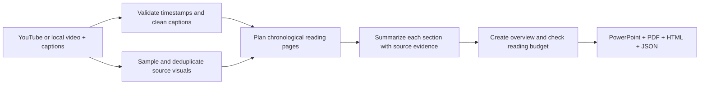

# Video Book Agent

Turn a long video and its timestamped transcript into a PowerPoint reading book, a PDF, and a searchable HTML book. Each content page pairs an original video visual with a concise presenter summary, key points, and a timestamp linking to the source. Full captions remain in PowerPoint notes and expandable HTML sections.

The default is **up to 200 total pages with a 60-minute reading target**. That includes a cover and overview, leaving 198 content pages. For a four-hour recording, a typical page represents roughly 70 seconds of speech. Page boundaries favor nearby slide changes and balance transcript length. Short sources receive fewer pages rather than filler.

## Try the installed agent

From this project directory:

```sh
.venv/bin/bookagent doctor
.venv/bin/bookagent demo
```

The demo creates an eight-slide **synthetic sample lesson**, captures its visuals, and exports ten pages to `output/demo/book.pptx`, `book.pdf`, and `book.html`. It needs no API key and uses explicitly labeled verbatim excerpts. It is not a summary of the example YouTube video.

A **200-page book with original captured visuals, concise presenter summaries, a reading map, and source timestamps** was prepared from the actual YouTube example in the development workspace. The summaries were authored in an assistant session without separate API calls. That workspace contains `output/plenary/book.pptx`, `book.pdf`, and `book.html`, plus source inputs and validated checkpoints in `output/plenary/work/`. **Generated books, downloaded videos, transcripts, and checkpoints are excluded from this repository and are absent from a fresh clone.** `examples/assemble_plenary.py` records the local assembly process and requires those saved session files. Use `bookagent demo` for a reproducible sample, or `bookagent build` to convert a new source.

For AI summaries, set `OPENAI_API_KEY` in your shell using your normal secret-management method, then run:

```sh
.venv/bin/bookagent build \
  'https://www.youtube.com/watch?v=Tcn5Yb2K0h4' \
  --pages 200 \
  --reading-minutes 60 \
  --out output/plenary
```

Quote URLs containing `&`. Playlist parameters do not cause playlist downloads. This example was verified as **“Plenary Stage - August 1st - Afternoon Session”**, Berkeley RDI, duration **4:09:58**, with English captions available. The standalone CLI uses an API key to automatically summarize new videos; reading locally generated output files does not require one.

The default model is configurable with `--model` or `BOOKAGENT_MODEL`. Use a model available to your API account that supports the Responses API, Structured Outputs, and image inputs. Use `--text-only-ai` to summarize captions without sending frames. AI mode sends source captions and, by default, captured frames to the API and incurs usage charges on that account.

## Install in another environment

Requires Python 3.11+ and FFmpeg 5.1+ (`ffmpeg` and `ffprobe` on PATH).

```sh
# On macOS, if FFmpeg is not installed:
brew install ffmpeg

python3 -m venv .venv
source .venv/bin/activate
python -m pip install -e .
bookagent doctor
```

`.env.example` documents the environment variables; the agent does not automatically read `.env` files.

## Use local files

YouTube can block automated downloads, and caption availability varies. Supply local files to use the same pipeline:

```sh
.venv/bin/bookagent build \
  'https://www.youtube.com/watch?v=Tcn5Yb2K0h4' \
  --video /path/to/session.mp4 \
  --transcript /path/to/session.vtt \
  --pages 200 --reading-minutes 60 \
  --out output/plenary
```

Here the URL provides playback links; the local files provide the content. To use only a transcript:

```sh
.venv/bin/bookagent build \
  --transcript /path/to/session.srt \
  --transcript-only \
  --duration 14998 \
  --out output/notes
```

Transcript-only pages explicitly mark missing original visuals. This agent requires existing transcripts and does not automatically transcribe audio. Plain untimed text is rejected because it cannot reliably align with the slides.

Supported caption formats: SRT, WebVTT, a JSON array with `start`, `end` (or `duration`), and `text`, or Whisper JSON with a `segments` array. Timestamps are seconds:

```json
[
  {"start": 0, "end": 25.5, "text": "The presenter explains the problem."},
  {"start": 25.5, "duration": 30, "text": "The presenter demonstrates the solution."}
]
```

Without an API key, `--provider extractive` produces labeled transcript excerpts. It is useful for validating ingestion and layout; it does not provide AI summaries.

## How the agent works



1. Prefer matching manually authored YouTube captions, falling back to automatic captions with a source note.
2. Capture video frames every 12 seconds in one FFmpeg pass; retain distinct visual states. `--frame-interval 3` captures shorter slides at greater processing/storage cost. `--crop x,y,width,height` isolates the slide area using normalized coordinates, for example `--crop 0,0,0.75,1` when slides occupy the left three quarters.
3. Assign every cleaned caption once to chronological content pages. The page intervals cover the source timeline. Overlapping captions belong to the page containing their start and may finish beyond that page's interval.
4. Summarize small batches using structured output. Preserve the presenter's qualifications and avoid adding outside facts. Short verbatim evidence quotes must match each page's source text; missing pages, unsupported quotes, and excessive word counts trigger retries and then a clear failure. Quote matching checks source evidence, but does not prove every paraphrase is accurate.
5. Reduce the page summaries into an overview, using bounded intermediate summaries for long books, then export native editable PowerPoint text, captured images, source links, and complete caption notes.

## Reading budget and limits

The one-hour target is approximate. The agent budgets 180 prose words per minute plus six seconds to scan each pictured content page. With 198 pictured content pages, this normally allows about **35 visible words per page**, including the title and takeaway. Text inside slide images and full transcript notes are excluded from that estimate; dense diagrams or equations take additional time.

The page count is a maximum. If the video has more visual states than the budget can picture, some pages summarize multiple source slides and show the one with the longest overlap. All captured samples remain under `work/frames`. Sampling and image differences approximate slide changes: short-lived slides, camera cuts, speaker motion, or similar slide designs can confuse detection. Crop to the slide region and reduce the sampling interval when appropriate.

Caption errors can propagate into summaries. Speaker names are used only when supported by the source. The overview and page summaries are synthesized reading notes, not a verbatim transcript or a substitute for checking a precise claim in the original video.

## Outputs and resuming

| File | Purpose |
| --- | --- |
| `book.pptx` | Editable reading slides, images, clickable timestamps, full caption notes |
| `book.pdf` | Printable landscape book with source links |
| `book.html` | Standalone book with embedded images, search, arrow-key navigation, full captions |
| `book.json` | Structured pages, source text, metadata, reading estimate, and limitations |
| `work/` | Downloaded inputs, captured frames, validated summary checkpoints |

Run the same command again to reuse validated summary and frame checkpoints. Summaries are keyed by source content, image bytes, model, prompt, and word budget. Downloads may still recheck YouTube availability. Keep the output directory to retain checkpoints.

Additional options: `--formats pptx,pdf`, `--title`, `--workers 1`, `--language en`, and `--text-only-ai`. Summaries are written in English; `--language` selects source captions.

## Verify

```sh
.venv/bin/python -m pip install -e '.[dev]'
.venv/bin/python -m pytest -q
```

Tests cover rolling captions, invalid timestamps, source coverage, visual selection and caching, evidence validation, summary checkpoint reuse, budget enforcement, and export reloads. API behavior is tested with a fake client; a live paid API conversion requires your configured key.

Primary implementation references: [OpenAI Structured Outputs](https://developers.openai.com/api/docs/guides/structured-outputs), [yt-dlp](https://github.com/yt-dlp/yt-dlp#embedding-yt-dlp), and the [example recording](https://www.youtube.com/watch?v=Tcn5Yb2K0h4).
